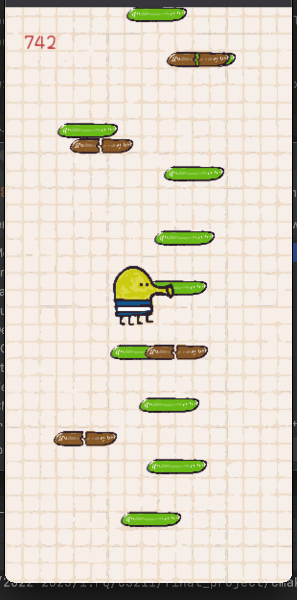

# Doodle-Bounce
by Julia Chu &amp; Janna Lee 

This a Doodle-Jump clone in C++ and ge211 library. 
 

 

The game achieves the following functionality: 

- When the game starts, the doodler is at the bottom, on a block. 
- Once the player clicks space, the doodler jumps 
- There will be random block initialization that allows the doodler to jump onto
- The player users the left, right arrow keys to control doodle position
- After each jump, the doodler will start to descent
- If the doodler does not land on a block to initialize a jump and falls to the end of the screen, the game ends
- If doodle hits a block, a positive boost will be added to the doodles negative velocity, making it jump up
- If the doodler hits a fragile/fake block, no boost will be added, but the block will disappear
- There will be a score that increase as doodle jumps higher
- The background (aka the blocks) will continuously move down the screen).

